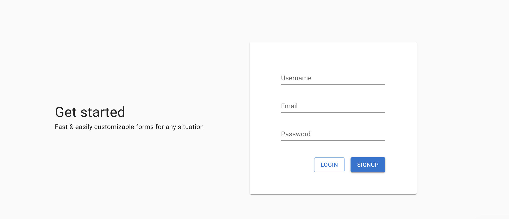
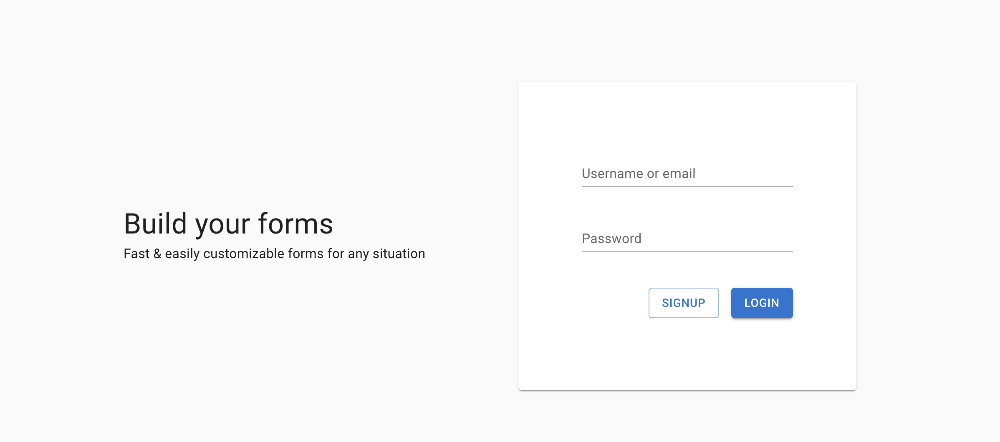
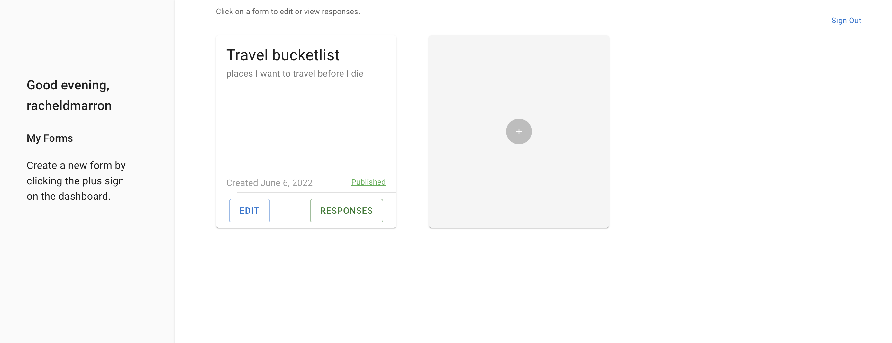
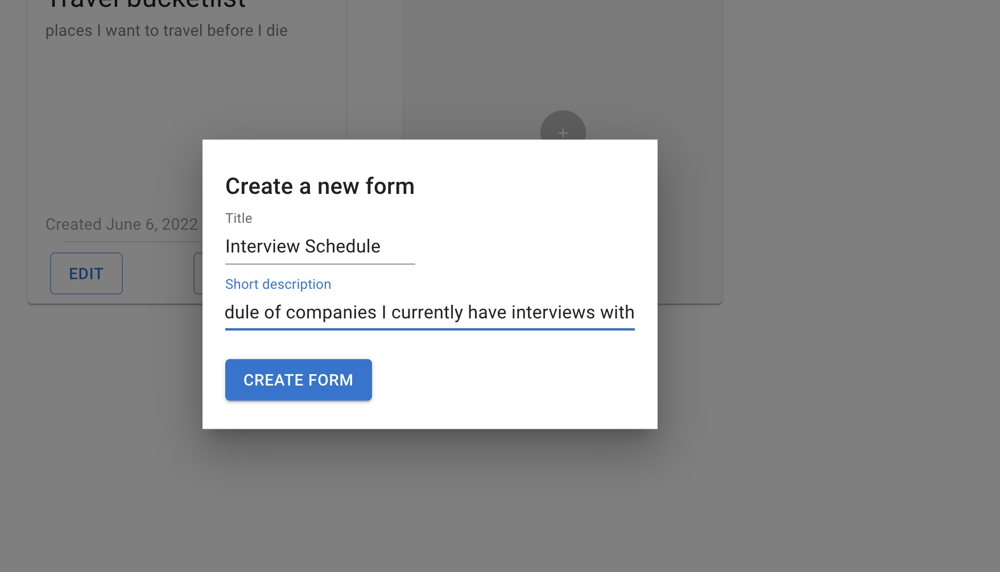
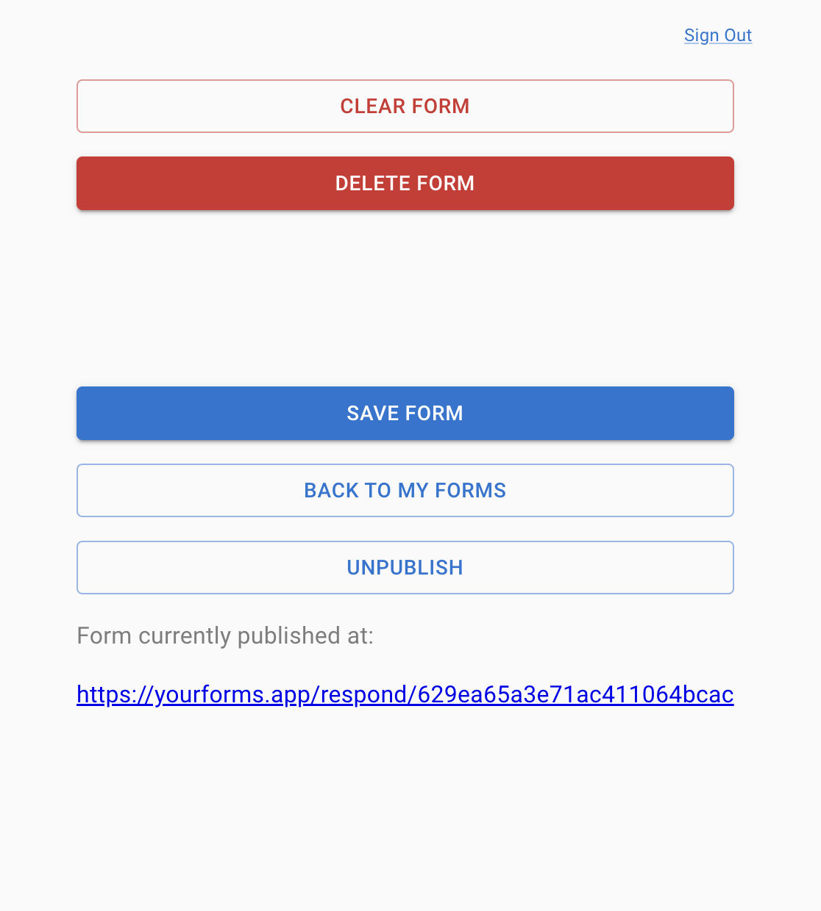
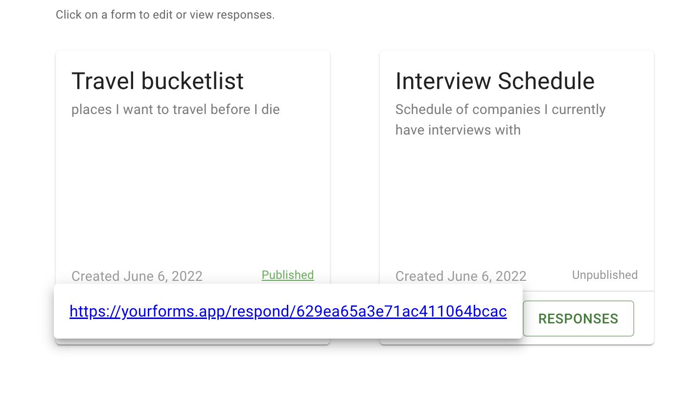

# YourForms.App 

# Link to Deployed Application
https://yourforms.app/

# Overview 
Fast & easy customizable forms for any situation. Whether you want to create a grocery list for your next party, draft interview questions, surveys, or a travel bucket list, YourForms.App has you covered. Built with React and MUI, this app offers clean and accessible UX that allows users to create an account and publish all of their forms in one, organized place. 

Offering a published link right from the dashboard allows users a quick and easy way to share their forms with anyone they want (a feature that Google Forms does not have). Integrated with PayPal API, users can pay for premium features such as unlimited form hosting capacity. 

# Table of Contents

  * [User Story](#user-story)
  * [User Acceptance](#acceptance-criteria)
  * [User Instructions](#user-instructions)
  * [Tools](#created-using)
  * [Dev Acceptance Criteria](#development-acceptance)
  * [Contributors](#contributors)
  * [License](#license)

# User Story
```
AS A user
I WANT an organized place to create and publish forms
SO THAT I can easily find and share my forms with necessary friends and stakeholders
```

# Acceptance Criteria
```
WHEN I land on the homepage of the app
THEN I am presented with the option to sign in or create a new account
WHEN I create a new account
THEN I am taken to a new screen to input my username, email, and password
WHEN I sign in
THEN I am taken to my personalized dashboard with an option to add a new form
WHEN I click the + button on the card to create a new form
THEN I am shown a pop-up to input the title and description for my form
WHEN I click "create form"
THEN I am taken to my form with the correct title and have options to add a header, divider, and question
WHEN I add content to my form
THEN I can view the formatted page updated with content of what my form will look like 
WHEN I hover over the content
THEN I am shown a pencil button to edit the content
WHEN I am editing the content in edit mode
THEN I am presented with the option to save or delete the content
WHEN I am adding new content to the form
THEN I have the option to clear form, delete form, save form, or publish form
WHEN I click "PUBLISH"
THEN I am shown a clickable link to view my published form
WHEN I click "BACK TO MY FORMS"
THEN I am taken back to my dashboard
WHEN I click the "Published"
THEN I am shown the published link with the ability to copy the link right from the dashboard
WHEN I click "RESPONSES"
THEN I see a timed log of every user update to the form
WHEN I sign out
THEN I am taken back to the log in landing page
```

# User Instructions (Visual References):









# Created Using: 
<ul><li>React.js</li>
<li>GraphQL</li>
<li>Node.js and Express.js</li>
<li>MongoDB</li>
<li>PayPal API</li>
<li>MUI</li>
<li>Deployed on: Heroku</li></ul>


# Contributors 
<ul><li><strong><a href="https://github.com/benw10-1" target="__blank">Benjamin Wirth</a>:</strong> Full Stack Engineer</li>
<li><strong><a href="https://github.com/grdnd" target="__blank">Gordon Do</a>:</strong> Front-End Engineer</li>
<li><strong><a href="https://github.com/nialvo" target="__blank">Nicholas Voloshanovich</a>:</strong> Full Stack Engineer</li>
<li><strong><a href="https://github.com/racheldmarron" target="__blank">Rachel Marron</a>:</strong> Project Manager, Front-End Engineer</li>
<li><strong><a href="https://github.com/mrjeoffrey" target="__blank">Jeoffrey Batangan</a>:</strong> UI Designer, Front-End Engineer</li></ul>

# License 

This application is covered under MIT License    

[](https://opensource.org/licenses/MIT)

- - -

© 2022 YourForms.App. All Rights Reserved.
